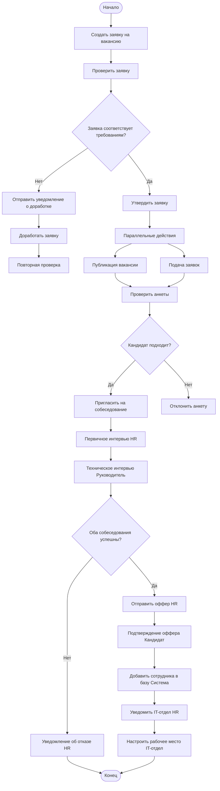

```mermaid
flowchart TD
    %% Руководитель отдела
    A1([Начало]) --> A2[Создать заявку на вакансию]

    %% HR-отдел
    A2 --> B1[Проверить заявку]
    B1 --> B2{Заявка соответствует требованиям?}
    
    B2 -- Да --> B3[Утвердить заявку]
    B2 -- Нет --> B4[Отправить уведомление о доработке]
    B4 --> A3[Доработать заявку]
    A3 --> B5[Повторная проверка]

    %% Параллельные действия: публикация вакансии и подача заявок
    B3 --> C1[Параллельные действия]
    C1 --> C2[Публикация вакансии]
    C1 --> C3[Подача заявок]

    %% Проверка анкет
    C2 & C3 --> D1[Проверить анкеты]
    D1 --> D2{Кандидат подходит?}
    D2 -- Да --> D3[Пригласить на собеседование]
    D2 -- Нет --> D4[Отклонить анкету]

    %% Этап собеседования
    D3 --> E1[Первичное интервью HR]
    E1 --> E2[Техническое интервью Руководитель]
    E2 --> E3{Оба собеседования успешны?}
    E3 -- Да --> F1[Отправить оффер HR]
    E3 -- Нет --> F2[Уведомление об отказе HR]
    F2 --> Z([Конец])

    %% Заключительный этап
    F1 --> G1[Подтверждение оффера Кандидат]
    G1 --> H1[Добавить сотрудника в базу Система]
    H1 --> I1[Уведомить IT-отдел HR]
    I1 --> J1[Настроить рабочее место IT-отдел]
    J1 --> Z


```
