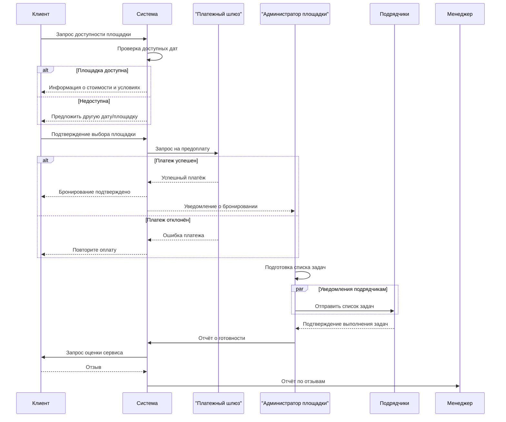

```mermaid
sequenceDiagram
    participant Клиент
    participant Система
    participant Gateway as "Платежный шлюз"
    participant Admin as "Администратор площадки"
    participant Подрядчики
    participant Менеджер

    %% Запрос на бронирование
    Клиент->>Система: Запрос доступности площадки
    Система->>Система: Проверка доступных дат

    alt Площадка доступна
        Система-->>Клиент: Информация о стоимости и условиях
    else Недоступна
        Система-->>Клиент: Предложить другую дату/площадку
    end

    %% Подтверждение бронирования
    Клиент->>Система: Подтверждение выбора площадки
    Система->>Gateway: Запрос на предоплату

    alt Платеж успешен
        Gateway-->>Система: Успешный платёж
        Система-->>Клиент: Бронирование подтверждено
        Система-->>Admin: Уведомление о бронировании
    else Платеж отклонён
        Gateway-->>Система: Ошибка платежа
        Система-->>Клиент: Повторите оплату
    end

    %% Организация мероприятия
    Admin->>Admin: Подготовка списка задач

    par Уведомления подрядчикам
        Admin->>Подрядчики: Отправить список задач
    end

    Подрядчики-->>Admin: Подтверждение выполнения задач
    Admin->>Система: Отчёт о готовности

    %% Завершение
    Система->>Клиент: Запрос оценки сервиса
    Клиент-->>Система: Отзыв
    Система->>Менеджер: Отчёт по отзывам
```
